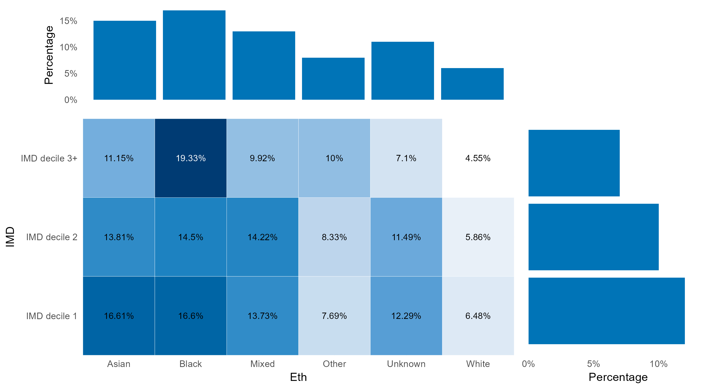
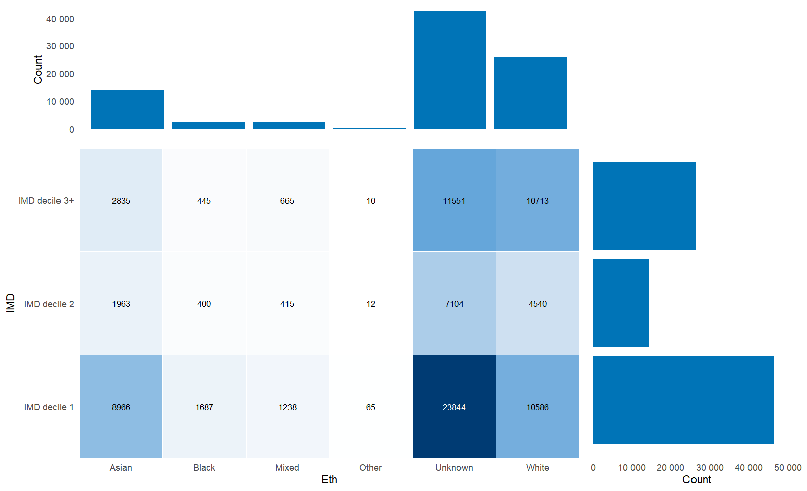
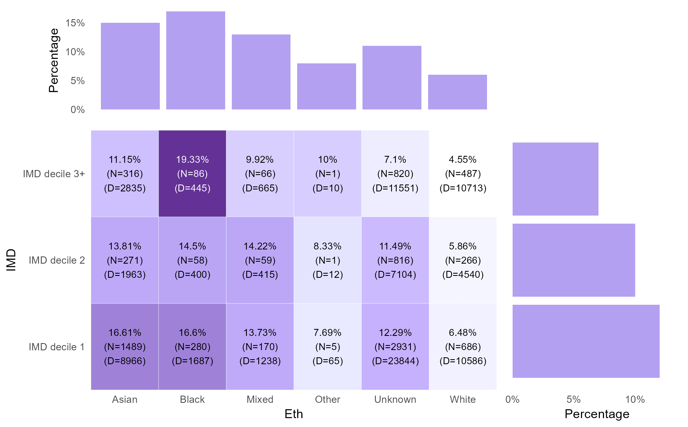

---
output:
  html_document: default
  pdf_document: default
editor_options: 
  markdown: 
    wrap: 72
---

# EquiR

GitHub: [EquiR](https://github.com/BCC-PHM/EquiR)

Chung Au-Yeung - BCC PHM

Late Updated: 2025-01-14

**The latest update of version 0.1.7 only support the
`Ineq_record_level_heatmap` function where `outcome` can be supplied by
the users to calculate within-group percentage.**

## Introduction

### What is EquiR?

EquiR is an R package designed specifically to streamline the creation
of combined heatmap, column, and bar charts within a single graph,
tailored for Birmingham City Council's needs. The primary objective of
EquiR is to simplify the process of generating such visualizations,
offering a range of functions optimised to accommodate various types of
data frames provided by users.

**!!Consider utilising categorical variables for plotting purposes, as
it is advisable to convert continuous data into categories prior to
utilising the functions.!!**

 EquiR example using NHS Health Checks
data

## EquiR basics

### Installing EquiR

The package can be installed the from GitHub by typing the following
command into the RStudio console:

``` r
devtools::install_github("BCC-PHM/EquiR")
```

`EquiR` will automatically download any missing prerequisite libraries
so this may take a few minutes the first time running it on your
machine.

### Loading EquiR

Once installed, you can open a new file by clicking the icon in the top
left corner of RStudio underneath "file". In this new script, you can
load the library at the start of a new R script using the following
function.

``` r
library("EquiR")
```

### Data requirements

The `EquiR` pacakge supports three types of data frames provided by the
users and they are:

1.  Record level
2.  Multidimensional
3.  Aggreated level

Different types of data frames require different functions to be used
from the `EquiR` pacakge. The following is the demonstration:

### 1.Record level data

Record-level data refers to individual entries or observations within a
dataset, each representing a distinct unit or instance of information.

| ID  | Age | Gender | HEIGHT\_\_value | WEIGHT_value | Smoking_status               | Ethnicity_Broad | Outcome      | IMD_decile    |
|--------|--------|--------|--------|--------|--------|--------|--------|--------|
| 1   | 42  | Male   | 1.83            | 84           | Never smoked                 | Asian           | Normal       | IMD decile 3+ |
| 24  | 66  | Male   | 1.66            | 72           | Non-smoker - history unknown | Asian           | Pre-diabetic | IMD decile 1  |
| 35  | 41  | Female | 1.515           | 66           | Never smoked                 | Asian           | Normal       | IMD decile 1  |
| 41  | 42  | Female | 1.58            | 65           | Never smoked                 | Asian           | Normal       | IMD decile 1  |
| 54  | 52  | Male   | 1.73            | 62           | Never smoked                 | Asian           | Normal       | IMD decile 3+ |

The function you will need to use from "EquiR" to make the plot is
`Ineq_record_level_heatmap()`. The function takes the following basic
arguments:

1.  `data`: A record level data supplied by users
2.  `col`: A column from `data` consisting a categorical variable
    defined by user which will be the column of the heatmap
3.  `row`: A row from `data` consisting a categorical variable defined
    by user which will be the row of the heatmap
4.  `coln`: The label to be displayed for the `col` on the graph defined
    by users
5.  `rown`: The label to be displayed for the `row` on the graph defined
    by users
6.  `unit`: user can define unit if supplied, otherwise unit will be
    count as always unless Percent argument is given T, then unit wil be
    Percentaage automatically
7.  `outcome`: To allow user to supply outcome variable to calculate
    within group percentage
8.  `inner_label`: To turn the information about the nominator and
    denominator on or off
9.  `colour`: User defined colour for the graph (Default = `"blue"`)

Therefore, we can generate the graph by running:

``` r
Ineq_record_level_heatmap(data = example_data,
                          col = "Ethnicity_Broad",
                          row = "IMD_decile",
                          coln = "Eth",
                          rown = "IMD",
                          unit = "Count",
                          colour = "blue" )
```

This produces a graph that looks like this:



If you don’t provide an `outcome`, each cell shows the count of
observations in that group. If you do supply an `outcome` (and it’s a
character or factor), the heatmap displays within-group percentages,
using the factor’s reference level as the numerator. To ensure you’re
using the correct numerator, set the desired reference level of your
factor explicitly. Otherwise, the function will default to the factor’s
first level.

we can generate the graph with `outcome` by running:

``` r
Ineq_record_level_heatmap(data = example_data,
                          col = "Ethnicity_Broad",
                          row = "IMD_decile",
                          coln = "Eth",
                          rown = "IMD",
                          unit = "Count",
                          outcome = "Outcome",
                          inner_label = TRUE,
                          colour = "purple" )
```



``` r
You are using the number of Pre-diabetic as the numerator to calculate the within-group percentage
```

When you provide an `outcome`, the function calculates **within-group
percentages**. To clarify which outcome level serves as the numerator, a
message is printed to the console. By default, `inner_label` is `FALSE`,
but if you set it to `TRUE`, the numerator (N) and denominator (D)
counts are also displayed in each cell.

### 2.Multidimensional data

Multidimensional data refers to datasets or information that contain
multiple variables or dimensions(\>=3), while a single column summarises
the number of observations corresponding to individuals meeting specific
conditions.

| LA Code   | LA         | Ethnic_group | Economic_inactive            | Age                    | Observation |
|------------|------------|------------|------------|------------|------------|
| E08000025 | Birmingham | White        | Retired                      | Aged 65 years and over | 97864       |
| E08000025 | Birmingham | Asian        | Student                      | Aged 16 to 24 years    | 30507       |
| E08000025 | Birmingham | White        | Student                      | Aged 16 to 24 years    | 28167       |
| E08000025 | Birmingham | Asian        | Looking after home or family | Aged 35 to 49 years    | 18123       |
| E08000025 | Birmingham | Asian        | Retired                      | Aged 65 years and over | 16280       |
| E08000025 | Birmingham | White        | Long-term sick or disabled   | Aged 50 to 64 years    | 13759       |
| E08000025 | Birmingham | White        | Retired                      | Aged 50 to 64 years    | 10661       |
| E08000025 | Birmingham | Black        | Student                      | Aged 16 to 24 years    | 10010       |

The function you will need to use from "EquiR" to make the plot is
`Ineq_multidi_level_heatmap()`. The function takes the following basic
arguments:

1.  `data`: A Multidimensional data supplied by users
2.  `col`: A column from `data` consisting a categorical variable
    defined by user which will be the column of the heatmap
3.  `row`: A row from `data` consisting a categorical variable defined
    by user which will be the row of the heatmap
4.  `value`: The variable that contains the sum of observations
5.  `coln`: The label to be displayed for the `col` on the graph defined
    by users
6.  `rown`: The label to be displayed for the `row` on the graph defined
    by users
7.  `unit`: user can define unit if supplied, otherwise unit will be
    count as always unless Percent argument is given T, then unit wil be
    Percentaage automatically
8.  `percent`: To allow the graph to display as percentage of total, the
    default dispaly is number
9.  `colour`: User defined colour for the graph (Default = `"blue"`)

Therefore, we can generate the graph by running:

``` r
Ineq_multidi_level_heatmap(data = example_data2, 
                           col = "Ethnic_group", 
                           row = "Age", 
                           value= "Observation",
                           coln = "Eth", 
                           rown = "Age gp", 
                           unit = "Count", 
                           colour = "red")
```

This produces a graph that looks like this:

::: {.figure style="text-align: center"}


<p class="caption">

</p>
:::

### 3.Aggreated level data

Aggregated level data within this package refers to information that has
been combined or summarized from individual-level data to provide a
higher-level perspective or summary. This dataframe is designed to
include only two columns of categorical variables and one column for
observations.

| Ethnicity | reason                       | Values |
|-----------|------------------------------|-------:|
| White     | Retired                      | 108806 |
| Asian     | Looking after home or family |  38004 |
| Asian     | Student                      |  34357 |
| Black     | Student                      |  31371 |
| White     | Long-term sick or disabled   |  28841 |
| White     | Looking after home or family |  21297 |
| Other     | Retired                      |  18448 |

The function you will need to use from "EquiR" to make the plot is
`Ineq_aggregated_level_heatmap()`. The function takes the following
basic arguments:

1.  `data`: An Aggreated level data supplied by users
2.  `col`: A column from `data` consisting a categorical variable
    defined by user which will be the column of the heatmap
3.  `row`: A row from `data` consisting a categorical variable defined
    by user which will be the row of the heatmap
4.  `value`: The variable that contains the sum of observations
5.  `coln`: The label to be displayed for the `col` on the graph defined
    by users
6.  `rown`: The label to be displayed for the `row` on the graph defined
    by users
7.  `unit`: user can define unit if supplied, otherwise unit will be
    count as always unless Percent argument is given T, then unit wil be
    Percentaage automatically
8.  `percent`: To allow the graph to display as percentage of total, the
    default dispaly is number
9.  `colour`: User defined colour for the graph (Default = `"blue"`)

Therefore, we can generate the graph by running:

``` r
Ineq_multidi_level_heatmap(data = example_data3, 
                           col = "Ethnicity", 
                           row = "reason", 
                           value= "Values",
                           coln = "Eth", 
                           rown = "reason", 
                           unit = "Count", 
                           colour = "blue")
```

This produces a graph that looks like this:

::: {.figure style="text-align: center"}


<p class="caption">

</p>
:::

## Customising your graph

### Colour palette

We can also change the colour palette by setting the `colour` argument.
The default is set to `"blue"` and currently only three more palette are
available namely `"purple"`, `"red"` and `"green"`.

### Percentage option

We can also change the heatmap, bar and column into percentage of total,
all the functions from "EquiR" have the option of turning the `percent`
argument on by passing `"percent= T"` . The `"unit"` will automaticaly
labeled as percentage if users do not supply one. We can generate the
graph in percentage by running:

``` r
Ineq_multidi_level_heatmap(data = example_data3,
                           col = "Ethnic_group",
                           row = "Age",
                           value= "Observation",
                           coln = "Eth",
                           rown = "Age gp",
                           percent = T,
                           colour = "red")
```

This produces a graph that looks like this:

::: {.figure style="text-align: center"}


<p class="caption">

</p>
:::
